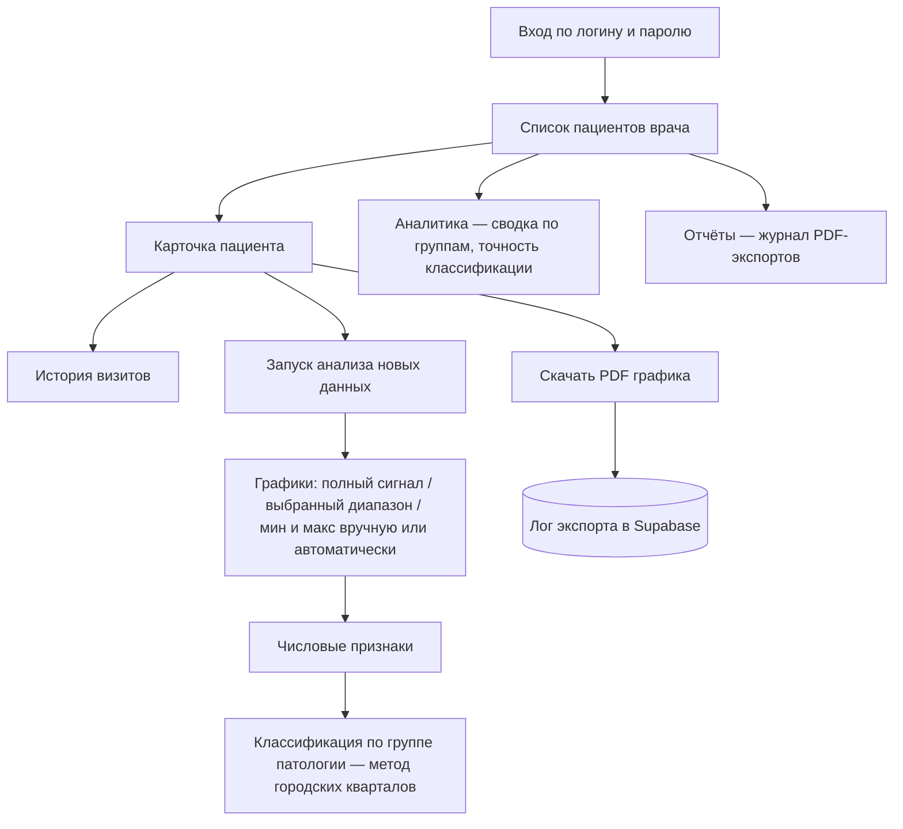

# Текст для кейса: eye-response-app

Черновик, собираю сюда все врезки по ходу работы. Курсивом идут технические заметки для себя, в самом кейсе их не будет.

## Конкурентный анализ: с чем сравнивать

Прежде чем показывать интерфейс, стоит понять, с чем его вообще сравнивать. Это очень узкая область: приборы и софт для ЭРГ и ЗВП делают всего несколько компаний в мире, и почти все они работают уже десятилетиями. Основные игроки: LKC RETeval, Diagnosys Espion, Metrovision Vision Monitor и Roland Consult RETIport. Последний из них, кстати, тот самый прибор, на данных которого построена вся эта работа: коды пациентов и признаки в приложении происходят именно из его CSV-экспорта.

Классический UX-teardown экрана конкурента здесь физически невозможен сразу для всех четырёх систем, и стоит сказать прямо почему, а не тихо пропустить раздел. Это не сайты с открытым триалом, а проприетарное ПО в комплекте с медицинским оборудованием, которое клиника покупает через отдел закупок, а не отдельный человек по подписке. Скриншот самого интерфейса нашёлся только у двух производителей (Diagnosys Espion и LKC RETeval, оба — в примерах отчётов и промо-материалах, не в виде живого продукта, см. врезку ниже). Поэтому вместо разбора экранов — таблица по тому, что реально можно проверить по открытым источникам: заявленные возможности, в каком виде отдаются результаты и как вообще получить доступ к системе.

| Система | Заявленные возможности | Формат вывода данных | Модель доступа |
|---|---|---|---|
| **LKC RETeval** | ЭРГ + ЗВП: диабетическая ретинопатия, глаукома, наследственные дистрофии сетчатки, ишемические поражения сетчатки, педиатрия; заявлена полная совместимость со стандартом ISCEV | Цветокодированные отчёты по возрастным референсным нормам (диабетическая ретинопатия, PhNR, flicker ERG, VEP) плюс сырые измерения; отдельный модуль RFF Extractor выгружает курсорные значения и кривые; заявлена интеграция с EMR/EHR | Устройство не продаётся онлайн — кнопка «Schedule a demo» и обращение к продажам. В фирменном магазине можно купить только расходники (сенсор-стрипы, кейс) |
| **Diagnosys Espion** | Sweep VEP (для детей и пациентов, которым сложно фиксировать взгляд), FST с тактильной обратной связью, ring ERG — скрининг ретинотоксичности примерно за минуту, мультифокальная ЭРГ с продольным сравнением визитов | Отдельный продукт eXporter одним кликом собирает общий transfer-файл и отдельные текстовые файлы по каждому тесту; конкретный формат текстовых файлов на сайте не раскрыт | Софт только «по запросу» (форма «Request Espion software V7»), публичной цены нет |
| **Metrovision Vision Monitor** | До 10 разных исследований на одной платформе: периметрия (авто/ручная), тёмная хроматическая периметрия, адаптометрия, FST, PAT, электрофизиология зрения, видеоокулография | Единая база данных на все тесты, заявлен «лёгкий экспорт данных», но конкретный формат файла на сайте не указан | Только форма запроса информации и PDF-брошюра, публичной цены и демо-доступа нет |
| **Roland Consult RETI-port/scan 21** | Pattern VEP + Pattern ERG + Flash VEP, ISCEV ERG, EOG (fast/slow), мультифокальная ЭРГ/ЗВП, проверка остроты зрения, скрининг глаукомы — набор протоколов зависит от одного из 10 уровней комплектации, от базовой до delta plus² | Все данные и результаты хранятся во внутренней базе прибора, биосигналы и усреднённые кривые выводятся на монитор; форматы экспорта (CSV и т. п.) на сайте не описаны | Только форма запроса с выбором модели, публичной цены и демо нет — тот самый прибор, на данных с которого построена вся эта работа |

Общая картина честная сама по себе: ни у одного из четырёх производителей нет пункта «открытая веб-версия» или «публичная цена» — весь рынок продаёт через отдел закупок клиники, а не через сайт. Формат вывода данных нигде толком не раскрыт публично: ни один производитель не публикует документацию по структуре экспортируемого файла, поэтому сравнивать здесь получается только маркетинговые формулировки, а не реальные форматы.

У всех четырёх систем похожий подход к интерфейсу, и он понятен. Софт делают инженеры для операторов, которые проходят специальное обучение перед тем, как сесть за прибор. У Diagnosys Espion, например, экран записи выглядит так: чёрный фон и десятки мелких кнопок в ряд, усиление, фильтры, маркеры каналов, экспорт. Всё нужное для настройки записи под рукой, но новому человеку разобраться там без инструкции почти нереально. У LKC RETeval отчёт устроен иначе, ближе к медицинскому документу: таблица с показателями, цветовая кодировка нормы и отклонения, кривые под каждым глазом. Получается понятнее, но это статичный отчёт, PDF или его аналог, а не интерфейс, с которым работают дальше.

Общее у всех четырёх: они делают запись и обработку сигнала, и с этой задачей справляются хорошо. Работа с историей пациента, сравнение визитов, обычная навигация по базе стоят на втором плане, потому что не ради этого прибор покупают.

Мой проект начинается ровно там, где заканчивается эта часть. Он не записывает сигнал и не управляет прибором. Он берёт уже посчитанные из ЭРГ числовые признаки, по методике из ВКР, и превращает их в то, чем врач реально пользуется день за днём: список пациентов, карточку с графиком, историю визитов, классификацию по группе патологии. Это осознанное сужение задачи, а не недоделанная копия большого прибора: софт вроде Espion или RETIport всё равно нужен для самой записи, приложение его не заменяет и заменять не должно.

Разница в аудитории тоже принципиальная. Espion и RETIport рассчитаны на технолога-оператора в кабинете диагностики, который следит за качеством сигнала прямо во время записи. Моё приложение рассчитано на врача, который смотрит результат уже после, часто не в тот же день и не за тем же компьютером. Отсюда и вся разница в языке интерфейса: не панель управления прибором, а рабочий стол с данными пациента.

### Скриншоты для врезки

Сохранила в `case-references/`, всё из официальных материалов производителей, это публично доступные страницы:

- `diagnosys-espion-v7-ui.jpg`: экран записи Diagnosys Espion V7, тот самый плотный ряд кнопок на чёрном фоне
- `lkc-reteval-report.jpg`: пример отчёта LKC RETeval, табличный формат с цветовой кодировкой
- `roland-consult-retiport-setup.jpg`: рабочее место с RETIport/scan 21 (тот самый прибор из ВКР), два монитора и стимулятор

*Не нашла нормального скриншота софта Metrovision Vision Monitor. На сайте и в PDF-брошюрах только фото железа и общие иллюстрации, самого интерфейса нигде не показывают. Если нужен пример именно этой системы, придётся искать отдельно (YouTube-демо, форумы пользователей), либо можно оставить как есть: три примера уже дают представление о жанре.*

## Глубинное интервью, персоны и user flow

Формального интервью с врачами в этом проекте не было, и честнее сразу об этом сказать. Были разговоры с научным руководителем обеих ВКР, Дмитрием Валерьевичем Вершининым, в процессе самой работы, и один из научных руководителей кафедры на себе проходил такое исследование. Но эти разговоры не записывались и не превращались в цитаты, поэтому строить персоны на выдуманных высказываниях было бы нечестно. Источником стали сами тексты ВКР: в них уже описана и процедура исследования, и то, как реально должен работать врач с результатами, просто это было записано не как пользовательские сценарии, а как часть методологии и технического задания к прототипу.

### Пациент

Процедура ЭРГ описана в первой главе ВКР довольно подробно, и из этого описания понятно, через что проходит пациент, даже без прямых цитат. Перед исследованием в оба глаза закапывают капли и ждут 20-30 минут, пока зрачок расширится и глаз адаптируется к темноте. Активный электрод располагается на роговице через контактную линзу, референтный электрод на сосцевидном отростке или тоже на линзе, третий, заземляющий, на лбу. Правый и левый глаз проверяют отдельно, а после основной части глаз снова начинают освещать и повторяют измерения уже в других условиях адаптации. Для пациента это не быстрый осмотр на пять минут, а довольно долгая и не самая комфортная процедура с электродами на лице. Само приложение с пациентом напрямую не работает, но эта картина важна как контекст: данные, которые врач потом видит на экране, стоили пациенту реального времени и неудобства, и это лишний аргумент в пользу того, чтобы результат можно было пересмотреть позже, а не потерять в бумажном отчёте.

### Врач

Врач-офтальмолог, работающий с базой пациентов, и есть основной пользователь, и его путь в старом прототипе из ВКР уже был продуман довольно подробно. Авторизация по логину и паролю открывает список пациентов именно этого врача. Дальше нужно найти пациента, посмотреть его историю или запустить анализ новых данных.

Интересная деталь нашлась при сравнении двух версий ВКР. В бакалаврской работе 2021 года такого интерфейса для врача ещё не было вообще, там речь шла только про алгоритм обработки сигнала. К магистерской 2022 года появился весь слой софта для клиники, включая поиск пациента, и в тексте прямо написано, что первая версия поиска (по фамилии и полному возрасту) оказалась неудобной и её заменили на выпадающий список с фильтрацией по мере набора фамилии. То есть это не придуманная задним числом проблема, а реальная итерация UX, которая уже произошла один раз до того, как я начала переделывать проект в eye-response-app.

### User flow

В главе 2 ВКР путь пользователя описан пошагово, и он почти без изменений лёг в основу нового приложения: вход, список пациентов, выбор конкретного пациента, просмотр истории его визитов, запуск анализа новых данных, просмотр графиков (полный сигнал, сигнал в выбранном диапазоне, минимум и максимум вручную или автоматически), и в конце числовые признаки, по которым определяется группа патологии.

Схема того же самого — не гипотетическая, а факт того, как приложение устроено сегодня:

Последний шаг описан особенно точно: с помощью метода городских кварталов считается расстояние между признаками пациента и средними значениями по группам, и по этому расстоянию определяют, подтверждён диагноз или пациента стоит отправить на повторный осмотр. Это тот самый момент решения, ради которого врач вообще открывает карточку пациента, и именно поэтому страница пациента в eye-response-app заканчивается не просто графиком, а понятной классификацией по группе. При этом в заключении ВКР прямо написано, что у разных патологий области значений признаков заметно пересекаются и это осложняет диагностику. Поэтому классификация в приложении честно показана как поддержка решения, а не как окончательный диагноз, и это тоже не случайный выбор, а прямое следствие того, что показало исследование.

*Про самообследование научного руководителя: в текстах ВКР этого нет, это только из разговора, и конкретных деталей (как ощущались вспышки, сколько занял процесс, что было неожиданно) я не придумывала. Если хочешь, чтобы в кейсе была эта история, накидай пару фраз, что запомнилось, и я аккуратно впишу её как реальный эпизод, а не реконструкцию.*

### Вайрфреймы — почему их не будет

Отдельной вайрфрейм-стадии в этом проекте не было: экраны собирались сразу в коде, итеративно, в диалоге, а не сначала на бумаге или в Figma. Нарисовать сейчас черновики и выдать их за ранний архивный артефакт значило бы нарушить тот самый принцип «честность по дизайну», вокруг которого построен весь остальной кейс — историю процесса нельзя переписывать задним числом только ради того, чтобы кейс выглядел привычнее. Поэтому вместо вайрфреймов здесь — прямое объяснение, что процесс был code-first. Настоящая демонстрация работы в Figma в этом кейсе устроена иначе: не поддельная история о том, «как задумывалось», а кликабельный прототип и структура компонентов, собранные сейчас, честно как есть.

## Визуальный стиль: осознанное решение не переделывать

Отдельного визуального редизайна в этом кейсе не будет, и это тоже решение, а не пропущенный этап. Систему стоит показать такой, какая она есть, с объяснением, из чего она состоит и почему в целом её не пришлось трогать заново на этом проходе.

Шрифт держится на двух начертаниях на весь интерфейс: обычное для основного текста и более плотное для заголовков и смыслового выделения, оба заданы один раз для всего приложения, а не подбираются заново на каждом экране. Есть и пара исключений на самых мелких элементах, вроде счётчика на колокольчике уведомлений: там текст настолько мелкий, что стандартная жирность читается хуже, а не лучше, поэтому вес чуть скорректирован в одну или другую сторону. Таких исключений можно пересчитать по пальцам, и каждое объясняется размером текста, а не случайностью.

Цвет устроен так же системно: акцентный цвет, фон, приглушённый текст, цвета предупреждения и подтверждения заданы один раз и переиспользуются везде, от кнопок до бейджей. Ни один экран не придумывает себе отдельный оттенок под конкретную задачу.

Карточка данных, белая, со скруглёнными углами и тонкой рамкой, это один и тот же переиспользуемый элемент на десяти разных страницах: от списка пациентов и карточки визита до настроек, отчётов и справки. Раньше похожая карточка на разных экранах могла оказаться собрана по-разному, а теперь это ровно один и тот же компонент.

Отдельно стоит сказать про доступность для дальтоников, потому что здесь было реальное исправление, а не только описание того, что и так работало. На графике ЭРГ кривая пациента и кривая нормы уже различались и цветом, и типом линии (сплошная и пунктирная), это было сделано сразу. А вот на точечной диаграмме на странице «Аналитика» четыре группы патологий сначала различались только цветом точек, и это я проверила и доработала: добавила отдельную форму маркера на каждую группу: круг, квадрат, треугольник, крест. Теперь группу можно отличить даже без восприятия цвета.

С учётом всего этого дальнейшая доработка визуального стиля сейчас не в приоритете. Система уже опирается на общий набор правил и переиспользуемых элементов, а не на разрозненные решения по каждому экрану, и время выгоднее потратить на исследовательские материалы и текст кейса. Если у тебя есть конкретный экран, который смущает именно тебя, это стоит обсудить отдельно, а не как часть общего визуального прохода.

## Честность по дизайну

У проекта есть один принцип, который проходит через всё приложение, а не просто список фич: если данных для чего-то не хватает или метод даёт неидеальный результат, это показывается прямо, а не маскируется под уверенный интерфейс. Ниже три конкретных места в приложении, где это решение видно.

### Расхождение с историческими данными показано, а не спрятано

Старый метод расчёта, унаследованный ещё от исследовательского инструмента для той же ВКР, был настроен под один конкретный исторический файл с зафиксированным шагом измерения. Реальные файлы с прибора устроены немного иначе, и я не стала подгонять новые данные под старые цифры: приложение честно берёт параметры из каждого нового файла, а не притворяется, что все файлы одинаковые. Из-за этого точные цифры по новому файлу с прибора не обязаны один в один совпадать с историческими значениями из таблиц ВКР, это тот же метод, применённый к другому файлу, а не гарантированное повторение старого расчёта. Это не спрятано где-то в глубине системы, а прямо написано пользователю: под графиком есть пояснение, что числа получены тем же методом, но по другому исходному файлу, и поэтому не обязаны совпадать с ранее сохранёнными значениями.

### Колокольчик уведомлений без выдуманной активности

Колокольчик в шапке показывает только то, что и так уже посчитано или сохранено, без отдельной ленты «активности», которую пришлось бы придумывать. Первый тип уведомлений: пациенты, у которых автоматическая классификация расходится с диагнозом, сохранённым в карточке, хотя бы по одному визиту, это тот же результат, что уже виден в общем списке пациентов, просто вынесенный на видное место. Второй тип: пациенты, реально добавленные за последние две недели, по настоящей дате создания записи. В демо-версии без базы данных эта дата почти всегда пустая, и тогда список уведомлений просто пуст, и это не баг, а честный результат: придумывать «недавно добавленных» не из чего.

### Пустое состояние вместо нуля из ниоткуда

На странице «Отчёты» журнал скачиваний PDF-графиков может оказаться в одном из трёх разных, но одинаково честных состояний. Если база данных не подключена, так и написано: журнал ведётся только при подключённой базе, писать сейчас некуда. Если база подключена, но графики ещё никто не скачивал, показано «Пока пусто» с уточнением, что скачиваний действительно не было. И только если записи реально есть, появляется таблица. Ни в одном из этих состояний нет нуля, поставленного просто потому, что данных не нашлось, каждое состояние объясняет, почему оно выглядит именно так.

## Как научный метод из ВКР стал частью интерфейса

Ядро приложения, графики частотных характеристик, из которых потом строится вся классификация, не взято из готовой библиотеки, а перенесено из расчётного метода, который я использовала ещё в самой ВКР, в магистерской версии. Идея метода простая: реальный сигнал с прибора сравнивается с эталонным, специально построенным сигналом, и по разнице между ними строятся частотные характеристики, по которым потом определяется группа патологии.

Перенос не был точной копией, и это тоже стоит показать честно, а не спрятать. В историческом расчёте было несколько узких «заплаток»: пара мест, где значения вручную обнулялись, потому что в одном конкретном историческом файле там была помеха. Эти заплатки завязаны на один конкретный файл и не имеют смысла для любого другого сигнала, поэтому в приложении их нет, и я явно написала об этом в документации, а не тихо убрала. Вместе с уже упомянутой разницей в исходных файлах это значит, что точные цифры в приложении не обязаны совпадать один в один с цифрами из диплома: метод тот же, а входные данные и часть старых хаков, подогнанных под один-единственный файл, уже другие.

## Приватность данных как дизайн-решение

Доступ к приложению устроен так, что без входа в систему нельзя ни посмотреть, ни изменить ни одной записи: анонимные запросы к базе данных запрещены полностью, это настроено на уровне самой базы, а не только на уровне интерфейса, так что обойти это, просто открыв другой экран, не получится. Здесь важно сформулировать честно, без преувеличения: сейчас это не разграничение «каждый врач видит только своих пациентов», а более простой барьер «без входа доступа нет вообще», потому что проект сейчас рассчитан на одного врача. Если он станет многопользовательским, у меня уже есть точный план, как разграничить доступ по врачам, точно так же, как это было устроено в самой ВКР.

Отдельно устроена работа с настоящими персональными данными. У девяти пациентов группы «Миопия» в исходных материалах ВКР есть настоящие имена и даты рождения, и эти данные физически не попадают ни в публичный код, ни в собранную версию приложения, я проверила это дважды: полной сборкой с файлом на месте и без него, в обоих случаях результат одинаковый. Публичная демо-версия и вовсе не использует эти данные: там у всех тридцати пациентов полностью придуманные имена и даты рождения, специально помеченные как вымышленные, включая тех восьмерых пациентов «Миопии», у которых где-то рядом существуют настоящие имена, здесь для них стоят другие, тоже вымышленные.

## Новое, что появилось по ходу разработки

Часть решений в проекте появилась не на этапе планирования, а уже в процессе, когда стало понятно, как приложение должно работать на самом деле.

Профиль врача в настройках сделан нередактируемым осознанно, а не потому что не успела. Оказалось, что имя и специализация это не то, чем управляет сам врач: их задаёт администратор клиники при создании аккаунта, а к врачу относится только смена пароля, с проверкой старого пароля перед новым, что важно для общего компьютера в кабинете на несколько врачей.

Экспорт в PDF на карточке пациента работает без единой сторонней программы для генерации PDF. Кнопка «Скачать PDF» открывает системный диалог печати браузера, специальная настройка при этом прячет всё, кроме самого графика, так что человек сам выбирает, куда сохранить файл, а не получает его сразу с сервера. Сам факт скачивания при этом сохраняется в базе (кто, когда, какой пациент и глаз), но если сохранить запись не получилось, это не мешает печати: файл всё равно сохранится, потому что потеря записи в журнале не повод ломать то, что нужно врачу прямо сейчас.

Точность классификации на странице «Аналитика» тоже честная деталь, не заимствованная из диплома, а пересчитанная заново. Процент не зашит заранее: при каждой загрузке страницы приложение заново сравнивает результат метода с сохранённым диагнозом по всем текущим пациентам и визитам. На живых данных это число будет меняться по мере того, как добавляются новые пациенты и визиты. В демо-версии без базы данных источник тот же статичный набор из ВКР, что и везде в демо-версии, поэтому цифра похожа на историческую, но она всё равно посчитана заново, а не скопирована из таблиц диплома.
